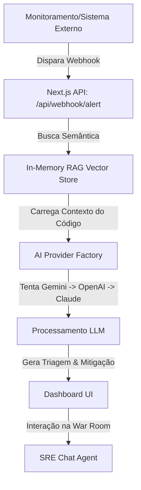

# 🚀 AI-Powered Incident Command Center (SRE Copilot)

Este é um projeto de nível profissional projetado para demonstrar engenharia de software avançada com Inteligência Artificial, arquitetura orientada a eventos e resiliência de sistemas. Ele simula uma plataforma de comando de incidentes de produção onde alertas de monitoramento são triados automaticamente por IA.

---

## 🛠️ Arquitetura do Sistema

O fluxo de dados segue uma arquitetura orientada a eventos resiliente:



1. **Evento / Webhook**: Um sistema externo (ex: Sentry, Datadog ou app de produção) dispara um webhook contendo uma exceção ou stack trace.
2. **RAG em Memória (Retrieval-Augmented Generation)**: Na inicialização, a aplicação lê a codebase crítica (`src/data/mock-codebase`), gera embeddings semânticos dos arquivos e os armazena em uma Vector Store em memória.
3. **Fábrica de IA Multi-Provider**: O sistema tenta dinamicamente usar **Gemini**, **OpenAI** ou **Claude**. Se uma API Key não estiver configurada ou falhar, o sistema automaticamente faz fallback para o próximo provedor disponível.
4. **Triagem Automática**: A IA correlaciona o stack trace do erro com os arquivos de código relevantes recuperados pelo RAG, determina a causa raiz, a severidade e gera um plano detalhado de mitigação.
5. **War Room (SRE Agent)**: O desenvolvedor/SRE pode entrar em uma sala de chat dedicada para o incidente. O agente de IA possui o contexto completo do erro, do plano de mitigação e do código correspondente para responder perguntas técnicas e ajudar na resolução em tempo real.

---

## 🌟 Principais Diferenciais de Engenharia

*   **Resiliência Multi-Provider**: Implementação de design pattern *Factory* para provedores de IA, garantindo alta disponibilidade (se um provedor falhar, o outro assume de forma transparente).
*   **Embeddings & Busca Vetorial local**: Uso de embeddings (`text-embedding-004` ou `text-embedding-3-small`) para mapeamento de código e erro, eliminando a dependência de bancos de dados vetoriais externos para projetos de pequeno porte.
*   **Vercel AI SDK v5/v6**: Integração utilizando as práticas mais recentes da biblioteca oficial da Vercel (`@ai-sdk/react` e `ai`), incluindo uso de fluxos estruturados de chat e componentes reativos.
*   **Next.js 16 (App Router) & React 19**: Construído sobre as versões mais recentes das tecnologias de ponta do ecossistema Web.

---

## 🚀 Como Executar o Projeto

### Prerrequisitos

Você precisará de chaves de API para pelo menos um dos provedores de IA suportados (Gemini, OpenAI ou Anthropic).

### 1. Configurando Variáveis de Ambiente

Crie um arquivo `.env` na raiz do projeto `incident-command-center` com base no `.env.example`:

```env
# Provedor padrão (gemini | openai | anthropic)
AI_PROVIDER=gemini

# Chaves de API (o sistema tentará usar as chaves configuradas)
GEMINI_API_KEY=sua_chave_gemini
OPENAI_API_KEY=sua_chave_openai
ANTHROPIC_API_KEY=sua_chave_claude
```

### 2. Instalando as Dependências

```bash
npm install
```

### 3. Rodando em Modo de Desenvolvimento

```bash
npm run dev
```

Abra [http://localhost:3000](http://localhost:3000) no seu navegador para ver o dashboard inicial.

### 4. Simulando um Alerta de Incidente

Em um terminal separado, execute o script de simulação incluído para enviar um webhook para a aplicação:

```bash
node test-webhook.js
```

Isso simulará um erro real de falha de processamento de pagamento. Atualize o dashboard para ver o incidente triado pela IA e entre na **War Room** para interagir com o agente.

---

## 📁 Estrutura da Codebase

*   `src/app/api/webhook/alert/route.ts`: Endpoint receptor do webhook que gerencia a triagem automática.
*   `src/app/api/agent/chat/route.ts`: Endpoint do chatbot da War Room.
*   `src/lib/ai/provider.ts`: Fábrica de provedores de IA resiliente a falhas.
*   `src/lib/rag/store.ts`: Vector store em memória e lógica de embeddings.
*   `src/data/mock-codebase/`: Diretório contendo códigos simulados que a IA analisa para sugerir correções.
*   `src/app/incident/[id]/page.tsx`: Interface da War Room de incidentes integrada com o Agente SRE.

---

## 🧠 Conceitos Demonstrados no Portfólio

*   **RAG (Retrieval-Augmented Generation)** aplicado a busca semântica de código fonte.
*   **Engenharia de Prompt Avançada** para instruir agentes a agirem como engenheiros de SRE.
*   **Fallback Dinâmico de Serviços** para tolerância a falhas na camada de LLM.
*   **Componentes Reativos com Next.js App Router** e renderização híbrida (Server e Client Components).
